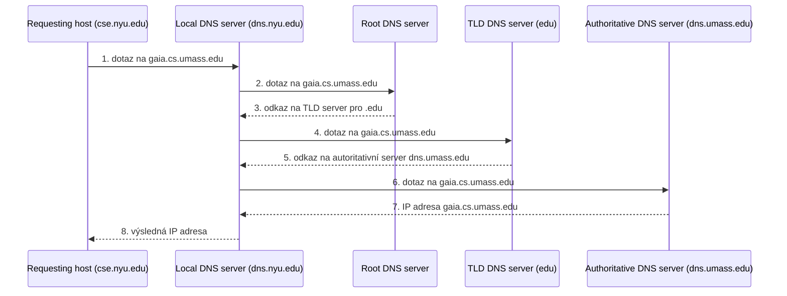
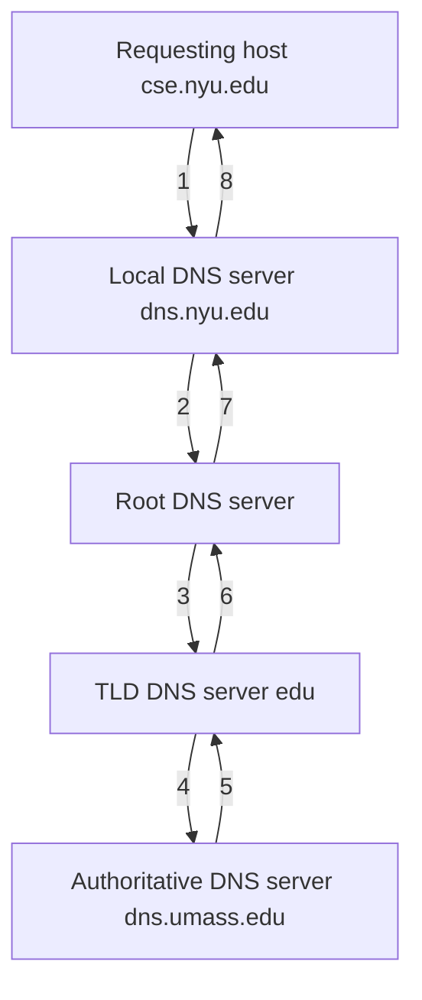

- *domain name system*
- = systém určený pro překlad doménových jmen na IP adresy a naopak
	- je hierarchický
	- není zabezpečený ([[#DNSSEC]] je zabezpečená varianta)
	- důvod zavedení: lidem se špatně pamatovaly [[IP protokol|IP adresy]] 
- běží na portu 53 a používá [[UDP protokol]]
- funguje na [[ISO OSI model#Transportní vrstva|transportní vrstvě]] 
- každá stanice má nastavenou adresu pro DNS server (buď staticky nebo ji získá dynamicky pomocí [[DHCP - dynamická konfigurace IPv4|DHCP]])
- při potřebě překladu se OS obrátí na [[#DNS Resolver]], který mu zařídí překlad dané adresy
- DNS servery jsou hodně cachované pro urychlení překladu
### Jak to funguje?
1. zadám pro prohlížeče `www.google.com`
2. OS se podívá do svého souboru `hosts.txt`, kde má uložené překlady na IP adresy
3. pokud neuspěje, zeptá se svého DNS Resolvera (specifikovaný v konfiguraci OS)
4. DNS Resolver se buď iterativně nebo rekurzivně snaží najít hledanou IP adresu pro dané doménové jméno
##### Iterativní DNS překlad
Při iterativním překladu doménového jména na IP adresu se dotazující server ptá postupně po jednotlivých úrovních, začínaje u kořenového DNS serveru a posouvaje se vždy o jednu úroveň níže.

Postup překladu:
- Resolver počítače potřebujícího přeložit doménové jméno odešle dotaz svému nadřazenému DNS serveru X.
- X se obrátí na kořenový DNS server (úroveň 0).
- Kořenový server vrátí X odkaz na DNS server spravující záznamy pro příslušnou TLD (úroveň 1), určenou podle první části doménového jména.
- Kroky dotaz-odpověď se opakují tak dlouho, dokud není dosažen záznam odpovídající poslednímu řetězci v doménovém jménu (zprava).
- Server X vrátí výslednou odpověď resolveru.

V ukázce na obrázku resolver počítače cse.nyu.edu požaduje překlad čtyřúrovňového doménového jména gaia.cs.umass.edu a jako první kontaktuje svůj lokální DNS server dns.nyu.edu.

##### Rekurzivní dotazování v DNS

Postup rekurzivního překladu doménového jména probíhá takto:
- A. Klient (resolver) zašle dotaz svému nadřazenému rekurzivnímu DNS serveru.
- B. Rekurzivní DNS server (Y) kontaktuje kořenový DNS server.
- C. Kořenový server podle první části překládaného jména přesměruje dotaz na DNS server o jednu úroveň níže.
- D. Krok B se opakuje, dokud není dosažen autoritativní DNS server odpovídající počtu částí překládaného doménového jména.
- E. Přeložená IP adresa spojená s daným doménovým jménem je postupně vracena zpět ke kořenovému DNS serveru.
- F. Kořenový DNS server předá přeloženou IP adresu zpět serveru Y.
- G. Server Y vrátí výslednou IP adresu původnímu resolveru.
### Hierarchie domén a doménových jmen
- doménová jména mají stromovou strukturu
- `www.timetable.fit.cvut.cz`
	- kořenová doména: `.cz` (úroveň zanoření 1)
	- subdoména: `cvut.cz` (úroveň zanoření 2)
		- subdoména subdomény: `fit.cvut.cz` (úroveň zanoření 3)
	- definice domény = množina různých doménových záznamů sdružených pod společným doménovým jménem
		- každá doména má svůj hlavní DNS server, který spravuje její konkrétní záznamy ([[#Doménový zdrojový záznam]])
- kořenové DNS servery
	- jsou rozdělené do 13. skupin po celém světě, udržují informace o DNS serverech domén 1. úrovně (TLD domén)
	- požadavky na kořenové servery se posílají anycastem (tedy hledám prvního, kdo mi odpoví)
	- tyto servery jsou v podstatě nahardcodované do OS, takže jejich IP adresy jsou dopředu známé
- DNS servery pro TLD (*top level domain*)
	- to jsou: 
		1. Generic Top Level Domains - `.gov`, `.edu`, `.com` atd.
		2. Country Code Top Level Domains - `.cz`, `.de` atd.
		3. New Generic Top Level Domains - `.paris`, `london` atd. - může to být libovolný řetězec
### Doménový zdrojový záznam
- záznam, který obsahuje konkrétní informace pro konkrétní doménové jméno
- mají různé typy:
	- A - mapuje doménové jméno na IPv4 adresu
	- AAAA - mapuje doménové jméno na IPv6 adresu
	- NS - určuje autoritativní DNS server pro danou doménu
	- MX - označuje server zajišťující příjem a doručování emailů pro doménu
	- CNAME - kanonické jméno sloužící jako alias (synonymum) k doménovému jménu
	- PTR - reverzní záznam sloužící k překladu IP adresy zpět na jméno
	- SRV - nese informace o rozšiřujících službách domény (například VoIP)
	- TXT - volný textový komentář přiřazený k doméně
	- CAA - specifikuje certifikační autority oprávněné vydávat certifikáty pro danou doménu
	- RRSIG - obsahuje veřejný klíč pro ověření platnosti DNS záznamů; využívá ho zabezpečená varianta DNS známá jako DNSSEC
### DNS protokol
- slouží pro zasílání dotazů a odpovědí v systému DNS
- většinou se používá [[UDP protokol]], port 53
- formát paketu je stejný pro dotaz i odpověď (v jednom paketu může být více dotazů i odpovědí)
### Reverzní dotaz
- opačný dotaz, pro danou IP adresu potřebuji doménové jméno
- funguje stejně, jako přímý dotaz s následujícími změnami:
	- za hledanou IP adresu se přidá `in-addr.arpa`: `DD.CC.BB.AA.in-addr.arpa`
	- finální reverzní překlad provede DNS server organizace, která má adresní rozsah na starosti
### DNSSEC
- založeno na [[Asymetrická kryptografie]]
- každý DNS server svoji odpověď podepíše svým soukromým klíčem
	- v nadřízeném DNS serveru je uložen veřejný klíč daného (podřízeného) serveru a tím jde ověřit pravost odpovědi
### DynDNS (dynamické DNS)
- pro zařízení, které často mění svoji IP adresu -> klasické DNS záznamy jsou nepoužitelné
- DynDNS server dokáže měnit A záznamy podle pokynů jednotlivých stanic
	- zařízení se připojí do sítě a místnímu DynDNS serveru nahlásí svoji IP adresu a doménové jméno
	- ostatní zařízení v síti se ptají DynDNS serveru na doménové jméno, dostanou uloženou IP adresu
	- kontrola dostupnosti zařízení se pravidelně opakuje (např. každých 10 minut)
### DNS Cache poisoning
- kybernetický útok, jehož cílem je vložit falešné záznamy do DNS resolveru (resp. do jeho cache), aby pak vracel podvodné servery i v případě, když uživatelé zadají správné URL
- ochranou je DNSSEC a krátké TTL záznamů v cache