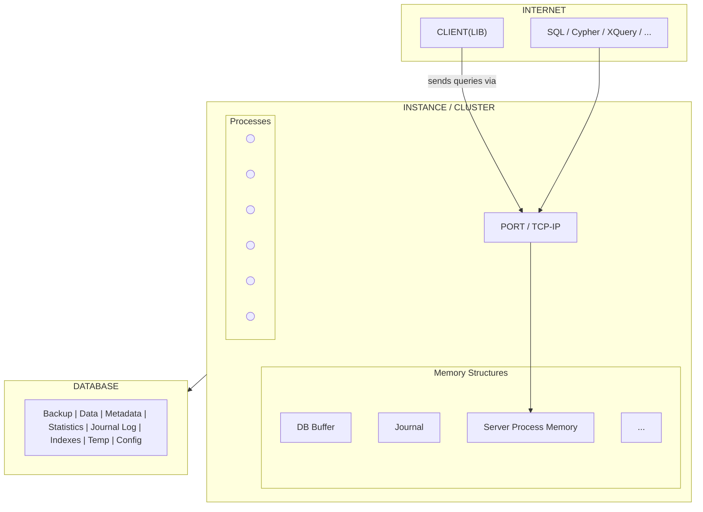

- na DB serveru (fyzický/virtuální) běží Linux/UNIX a tam je nainstalovaný databázový server
	- občas se ten OS musí nakonfigurovat (např. pro Oracle se musí zvětšit nějaké paramentry, protože má větší nároky)
- komunikuje se hlavně přes TCP/IP (jiné možnosti jsou, ale moc se nepoužívají)
- poslouchá se na nějakém portu
	- PostgreSQL: 5432
	- na portu proběhne autentizace/autorizace
		- pak dostanu samostatný proces, který si se mnou (jako s klientem) povídá
- 2 červené vrstvy (v obrázku)
	- instance/cluster
		- zajištuje připojování klientů a komunikaci s databázovou částí
		- Oracle - pojem instance
		- [[PostgreSQL]] - pojem cluster
			- cluster je tady sdílená paměť a různé procesy kolem
			- není to cluster v pravým slova smyslu
	- databáze
		- je perzistentní
		- nejde přistoupit přímo, musím nastartovat instanci/cluster a pomocí toho přistupovat
	- 80 % je to 1:1, může být více instancí/clusterů na 1 databázi, ale zas tak běžný to není
- se serverem se komunikuje pomocí API
	- 90 % je to SQL
	- další možnosti jsou CYPHER (např. pro [[Neo4j]])
	- XQUERY - pro XML-based databáze (to jsou např. [[Dokumentově orientovaná databáze]])