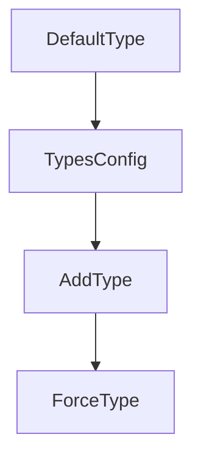

Obecně o [[MIME type]] zde.

Při přenášení souborů chceme s nimi mít i informaci, jak tyto soubory zpracovávat a interpretovat. Pomáhají nám v tom hlavičky:
- `Content-Type: image/gif`
- `Content-Language: cs, en`
- `Content-Type: text/html; charset=ISO-8859-2`
- `Content-Encoding: x-gzip`
	- udává obecně kódování dat (ne textu)
### Obecně
- název modulu: **mod_mime**
	- existuje také **mod_mime_magic**, umí podle prvních pár bytů určit MIME typ, pokud to nedá mod_mime (ale zatěžuje to server)
- když změním MIME informaci u souboru, tak `Last-Modified` se nezmění
- můžu mít více přípon
	- MIME typ se bere podle poslední přípony
	- ostatní přípony slouží pro další metainformace (např. jazyk, kódování apod.)
		- např. soubor `info.cs.utf8.html`
- na serveru je soubor, kde jsou všechny "pro server známé MIME types" definované (direktiva `TypesConfig`)
	- mohu je přidávat pomocí `AddType image/gif .gif`
- můžeme i forcovat MIME types
### Prioritizace
The diagram shows how Apache determines the MIME type for three example files (`index`, `index.abc`, `index.html`) as each directive is applied in sequence.

The resolution works layer by layer, with each directive potentially overriding the previous result:
- DefaultType - sets a fallback of `text/plain` for all files; `image/gif` is shown as an inherited default
- TypesConfig - loads `/etc/mime.type`, which maps `.html` files to `text/html`, while `index` and `index.abc` remain `image/gif`
- AddType - applies `audio/mpeg` to `.abc` and `.html` extensions, so `index.abc` and `index.html` both become `audio/mpeg`; `index` stays as `image/gif`
- ForceType - overrides everything with `image/jpeg`, so all three files (`index`, `index.abc`, `index.html`) end up as `image/jpeg`

The arrows in each column indicate which directives actively change the MIME type for that particular filename, while unchanged types carry forward from the previous step.