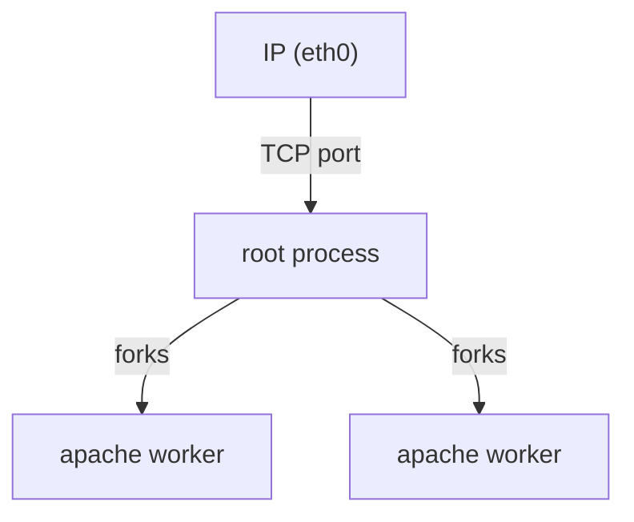
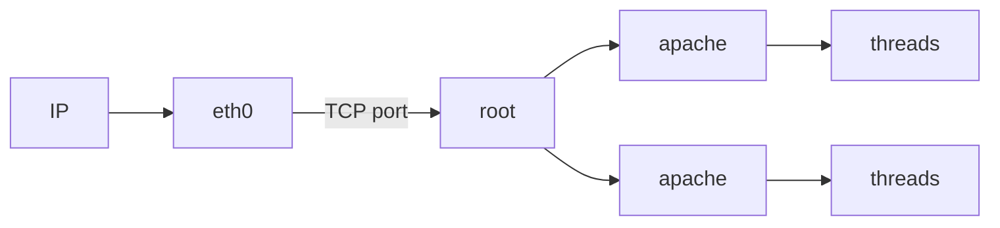
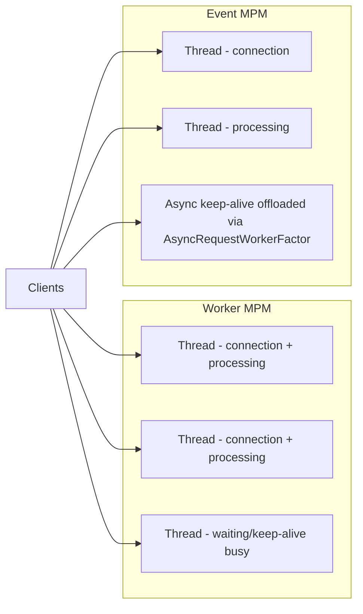

- MPM = multi processing modul
- kontroluje vytváření potomků (procesů a vláken)
- můžu použít POUZE JEDEN
	- výběr záleží na OS, který používám
# Pro Linux
## prefork
- pro správu procesů, obsluhu požadavků zajišťují procesy
- počet požadavků = počet procesů, které je obsluhují
- root proces rozděluje požadavky na procesy (pokud je nějaký volný)
- pokud mám moc požadavků
	- můžu nastartovat další proces
	- to jsou další systémové nároky - omezím si to, aby mi nedošla paměť
- stabilní a jednoduchý na debug
- zabírá více paměti (každý proces má vlastní paměť) a není tak výkonný při více procesech najednou

The root process binds to a TCP port on the network interface (eth0) and forks a number of child worker processes:
- StartServers - how many worker processes are spawned at startup
- MaxRequestWorkers (formerly MaxClients) - upper limit on the total number of simultaneous worker processes allowed
- Min/MaxSpareServers - controls how many idle workers are kept alive to handle incoming requests
	- mám nějaké volné, abych neplácal zdroje, ale aby byly nějaké hned ready, až přijde požadavek (startování procesu trvá nenulový čas)
- MaxConnectionsPerChild (formerly MaxRequestsPerChild) - limits how many connections a single child process will handle before being recycled, helping to contain memory leaks
## worker
- pro správu vláken (je starší, aktuální je [[#event]]), obsluhu požadavků zajišťují vlákna procesů
	- kombinuje tedy procesy a vlákna
	- pooluje procesy, které pak mají více vláken, které pak obsluhují uživatele
- je potřeba mechanismus zamykání paměti
- je to výkonnější
- je potřeba používat thread-safe knihovny, má složitější debug (pád vlákna ovlivní další vlákna v procesu)
- hodí se na statický obsah - tady sdílená paměť nevadí

A network interface (eth0) receives connections via an IP address and TCP port, forwarding them to a root process which then spawns child Apache processes.

Key configuration directives and what they control:
- MaxConnectionsPerChild (also called MaxRequestsPerChild) - limits how many connections a single child process handles before being recycled
- ServerLimit - controls the total number of child server processes that can exist
- StartServers - defines how many child processes are launched at startup
- ThreadsPerChild - sets the number of threads each child process maintains
- ThreadLimit - the upper ceiling on how many threads per child are permitted
- Min/MaxSpareThreads - keeps a minimum and maximum number of idle threads available to handle incoming requests
- MaxRequestWorkers (also called MaxClients) - the total maximum number of simultaneous requests the server will handle across all processes and threads
#### Problém Slow Loris
- navážu spojení a jako klient posílám data hrozně pomalu (můžu být útočník)
	- server se nudí, protože nemá (skoro) nic na zpracování
- ale rychle se vyplýtvá počet otevřených procesů
	- a server pak odmítá požadavky
- `mod_reqtimeout`
	- nastavím si nějakou svoji min. rychlost přijímání dat
	- pokud je to moc dlouhé atd. - tak ukončím spojení
	- různé timeouty pro hlavičky a jiné pro tělo
	- nějaká hodně špatná spojení (neútočící) to eliminuje :// - takže ne uplně ideální řešení
## event
- nabízí asynchronní zpracovávání, lepší podporu `Keep-Alive` spojení (u moderních webových aplikací)
- vyhradíme skupinu vláken, aby jenom přijímaly požadavky 
	- paralelně se tahají data od klientů a AŽ je celý požadavek hotový, tak se pošle do obslužného vlákna, které pak požadavek zpracuje
	- jedno vlákno paralelně přijímá požadavky
		- problém, že někdo zdržuje a natahuje mi už nevadí (vyřešen problém [[#Slow Loris]])
### Worker MPM vs Event MPM
The diagram compares how two Apache MPM (Multi-Processing Module) models handle client connections.
##### Worker MPM
Each client connection is handled by a dedicated thread that manages both the connection and the request processing. Threads waiting on keep-alive connections remain occupied ("busy"), meaning they are unavailable for new work even when idle.
##### Event MPM
The Event MPM separates concerns:
- Connection handling is managed independently from request processing
- A dedicated mechanism (using the AsyncRequestWorkerFactor directive) allows keep-alive/waiting connections to be offloaded, freeing worker threads to handle active processing

- The key difference is that Worker MPM ties up threads during keep-alive waits, while Event MPM frees those threads using asynchronous handling controlled by AsyncRequestWorkerFactor.