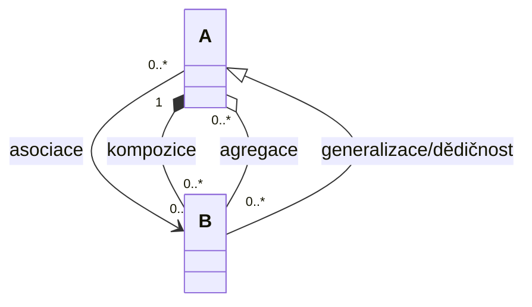
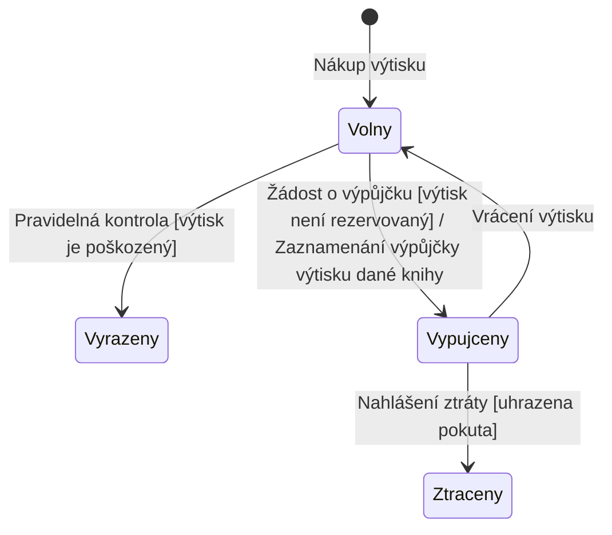

### Co je cílem doménového modelu?
- popsat data, se kterými se bude pracovat
- popis významů termínů - aby jim každý rozumněl  
- popis vazeb mezi entitami - pak je to základ pro databázový model (i když ten už se většinou generuje z hotové databáze)
- zachycení atributů jednotlivých entit

Vztah mezi entitami by měl mít vždycky popis:

- asociace - běžný vztah mezi třídami (násobnost 0..* na obou stranách)
- kompozice = těsný/silný vztah (jedna entita nemůže existovat bez druhé) - používá se spíše u abstraktnějších věcí než u fyzických
	- s kompozicí opatrně, je hodně striktní
	- silný vztah celku a části, část nemůže existovat bez celku (násobnost 1 na straně vlastníka)
- agregace = něco mezi asociací a kompozicí (radí se moc nepoužívat)
- generalizace / dědičnost - třída B je specializací třídy A
- co se týče dědičnosti, tak je to dost striktní vazba, takže s ní opatrně
	- mrkni, jestli se spíše nedá vyjádřit asociací
		- například: mám Vedoucího tábora a Hlavního vedoucího tábora (místo toho, abych dědil, tak přidám vazbu na Tábor "je vedoucím" a druhou vazbu "je hlavním vedoucím" - tím pádem nedojde k duplikaci)
	- při udělování dědičnosti řeš možné duplikace a kdy mohou nastat (s tím jsem měl problém v testu)

Asociační třída
- váže se k asociaci a přidává další atributy (např. délka trvání vztahu)
- často si vystačíme bez níc

Třídy (entity) jsou předměty, objekty z reálného světa, či podstatná jména z [[Modelování obchodních procesů|business modelů]], [[Modelování případů užití (Use Cases)|UC modelu]] či slovníčku pojmů (= glosáře, viz TUR)
### Násobnosti
- 0..1
- 0..*
- 1..1 nebo jenom 1
- 1..*
### Modelování stavů entit
- proč? 
	- chci porozumět tomu, jak jednotlivé entity mění stavy (jejich životní cyklus)
	- vyjasnit všechny stavy, ve kterých entita může být
		- a za jakých podmínek přechází entita z jednoho do druhého stavu
- pro názornost (a přehlednost) lze pro nějaké entity ještě namodelovat stavy
### Stavový diagram

Stavový diagram zachycuje stavy objektu a přechody mezi nimi. Klíčové pojmy:
- Stav - situace, ve které se objekt nachází
- Přechody - změny mezi stavy, popsané ve formátu Událost[Podmínka]/Akce
- Pozor - nejde o diagram aktivit!

### Příklad: stavový diagram výtisku knihy

- u výstupních hran se uvádí událost kvůli které se entita převedla do jiného stavu