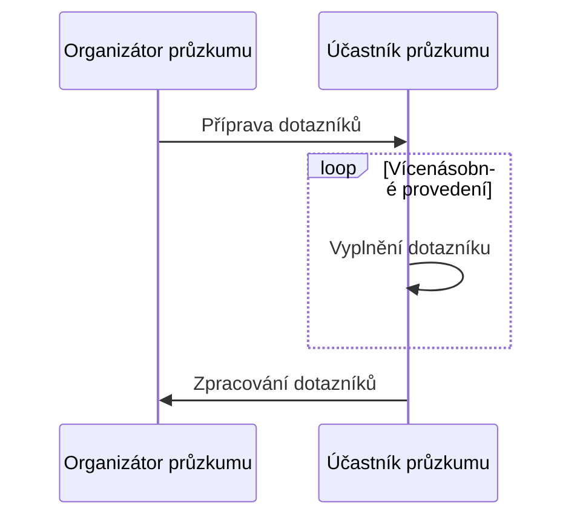
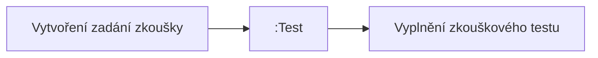
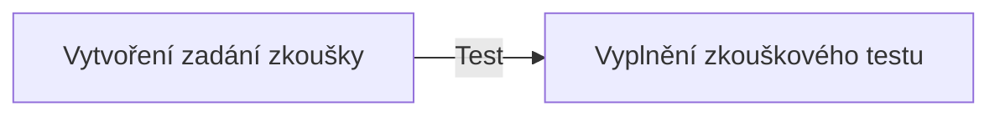
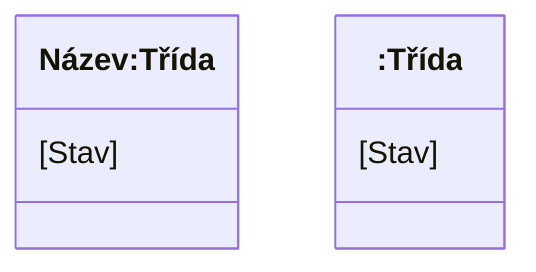
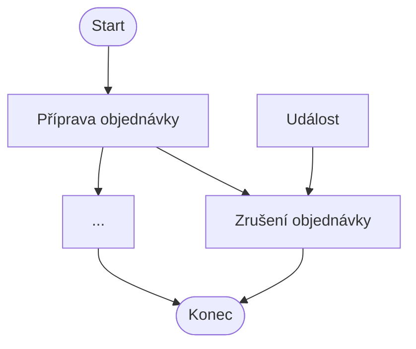

Obecně o UML zde: [[UML]], Diagram aktivit patří do skupiny diagramů chování (*behavioral diagrams*)
# Akční uzly
Akční uzly představují různé typy akcí v diagramu aktivit:
- Akce - základní akční uzel představující jednoduchou činnost
- Akce spouštějící aktivitu - akce, která vyvolá celou aktivitu
- Odeslání události - uzel reprezentující vyslání události do okolí
- Přijetí události - uzel čekající na příchozí událost
- Časová událost - speciální příjem události vázaný na čas (přesýpací hodiny)
# Řídicí uzly
Speciální uzly používané k řízení toku aktivit:
- Počáteční uzel - označuje začátek procesu
	- generuje ==tokeny== - simuluje průchod procesem
- Koncový uzel - označuje ukončení procesu
- Rozhodnutí (větvení/spojení) - místo, kde se tok rozděluje nebo slučuje
- Paralelní souběh (fork/join) - spuštění nebo synchronizace více paralelních toků
- Konec toku - ukončení konkrétní větve toku

- Každá akce se spustí až tehdy, když má na všech vstupech token
# Řídící uzly
- zelený kosočtverec s více vstupy - pokud mu na vstup přijde jakkýkoliv token, pošle ho dál
- končící hnědá ploška - nepustí tokeny dál, dokud nebudou na vstupech všechny (taková Bariéra v [[BI-OSY - rozcestník|BI-OSY]]) - dále pokračuje jen jeden
# Vícenásobné provedení akce
Diagram ukazuje swimlane rozdělený mezi organizátora průzkumu a účastníka průzkumu, přičemž akce vyplnění dotazníku je provedena vícekrát (znázorněno symbolem násobného výskytu).

- zde také vidím znázornění různých zodpovědností aktérů za části procesu (znázorněno v tzv. *swimlines*)
# Objektové uzly
Objektové uzly reprezentují tok objektů (dat) mezi akcemi v diagramu aktivit. Existují dva způsoby jejich znázornění:

První způsob zobrazuje objekt jako samostatný uzel (obdélník) vložený přímo do toku mezi akcemi:

Druhý způsob zobrazuje objekt jako malý čtvereček (pin) přímo na hranici akce, přičemž tok vede přímo mezi těmito piny:

Oba zápisy jsou sémanticky ekvivalentní - liší se pouze vizuální reprezentací předávaného objektu.
# Zachycení stavu objektu
Stav objektu lze zachytit třemi způsoby:
- Pojmenovaný - obsahuje název i třídu objektu
- Nepojmenovaný - uvádí pouze třídu objektu
- Stav se zapisuje v hranatých závorkách pod názvem objektu

- Přidání objektového toku
	- objektový a řídící tok na sobě vůbec nezávisí a nekolidují
- Doporučení: začít bez objektových uzlů a pak je tam postupně přidat
- Pro zachycení předávaných dat/entit mezi akcemi (lze doplnit i informaci o stavu)
# Diagram aktivit - UML
### Přerušení provádění

Aktivita může být přerušena vnější událostí, která způsobí opuštění aktuální oblasti a přechod do jiného stavu (např. zrušení objednávky).

Oblast přerušení je vyznačena přerušovanou hranicí - pokud nastane událost uvnitř této oblasti, provádění aktivit v ní je okamžitě ukončeno a tok pokračuje mimo ni.
- pokud token projde "bleskem" ke zrušení objednávky, tak se zruší všechny akce vykonané v tom regionu
### Chyby v diagramu aktivit
- z chyb si beru také to, že z akce vychází jen jedna šipka, veškeré rozdělování zajišťují kosočtverce a plošky
	- do akce může vcházet více tokenů, ale samotná akce se spustí až tehdy, když jsou na všech vstupech tokeny