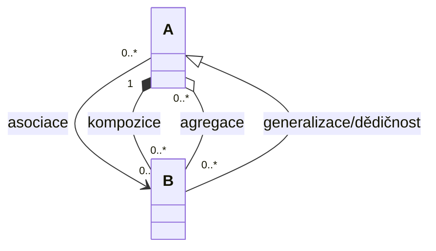
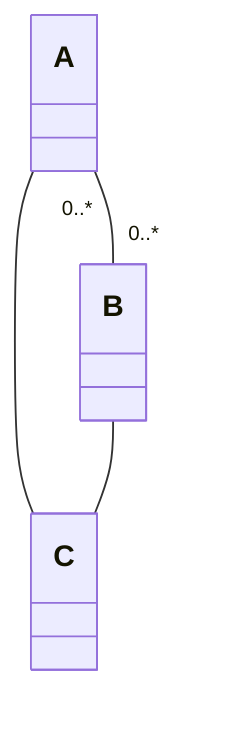
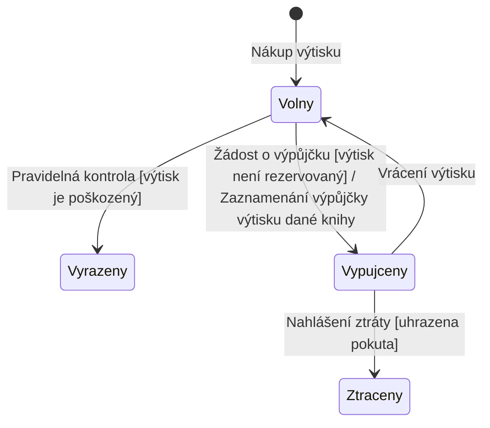

### Co je cílem doménového modelu?
- popsat data, se kterými se bude pracovat
- popis významů termínů - aby jim každý rozumněl  
- popis vazeb mezi entitami - pak je to základ pro databázový model (i když ten už se většinou generuje z hotové databáze)
- zachycení atributů jednotlivých entit

Vztah mezi entitami by měl mít vždycky popis:
%%replaced: Pasted image 20230520221158.png%%
# Diagram tříd
### Typy vztahů
Mezi třídami lze vyjádřit čtyři základní druhy vztahů:
- Asociace - běžný vztah mezi třídami (násobnost 0..* na obou stranách)
- Kompozice - silný vztah celku a části, část nemůže existovat bez celku (násobnost 1 na straně vlastníka)
- Agregace - slabší forma kompozice, část může existovat samostatně (násobnost 0..*); doporučuje se ji raději nepoužívat
- Generalizace / Dědičnost - třída B je specializací třídy A

### Násobnosti
Každý vztah může mít na svých koncích uvedenu násobnost, která říká, kolik instancí jedné třídy může být ve vztahu s instancemi druhé třídy (např. 1, 0..*, 1..*).
### Popisy vztahů
Vztahy lze doplnit textovým popisem (jménem asociace nebo rolemi), který upřesňuje jejich význam.
%%end replaced%%
- kompozice = těsný vztah (jedna entita nemůže existovat bez druhé) - používá se spíše u abstraktnějších věcí než u fyzických
	- s kompozicí opatrně, je hodně striktní
- agregace = něco mezi asociací a kompozicí (radí se moc nepoužívat)
- co se týče dědičnosti, tak je to dost striktní vazba, takže s ní opatrně
	- mrkni, jestli se spíše nedá vyjádřit asociací
		- například: mám Vedoucího tábora a Hlavního vedoucího tábora (místo toho, abych dědil, tak přidám vazbu na Tábor "je vedoucím" a druhou vazbu "je hlavním vedoucím" - tím pádem nedojde k duplikaci)
	- při udělování dědičnosti řeš možné duplikace a kdy mohou nastat (s tím jsem měl problém v testu)

%%replaced: Pasted image 20230520221326.png%%
# Diagram tříd - asociační třída

Asociační třída se ve většině případů nepoužívá - obvykle si vystačíme bez ní.

Třída C je asociační třída navázaná na vztah mezi třídami A a B (znázorněno přerušovanou čarou vedoucí ze středu asociace dolů k C).
%%end replaced%%
- váže se k asociaci a přidává další atributy (např. délka trvání vztahu)

Třídy (entity) jsou předměty, objekty z reálného světa, či podstatná jména z [[Modelování obchodních procesů|business modelů]], [[Modelování případů užití (Use Cases)|UC modelu]] či slovníčku pojmů (= glosáře, viz TUR)

### Násobnosti
0..1
0..*
1..1 nebo jenom 1
1..*

### Modelování stavů entit
- pro názornost (a přehlednost) lze pro nějaké entity ještě namodelovat stavy
%%replaced: Pasted image 20230520223334.png%%
# Stavový diagram

Stavový diagram zachycuje stavy objektu a přechody mezi nimi. Klíčové pojmy:
- Stav - situace, ve které se objekt nachází
- Přechody - změny mezi stavy, popsané ve formátu Událost[Podmínka]/Akce
- Pozor - nejde o diagram aktivit!

### Příklad: stavový diagram výtisku knihy

%%end replaced%%
- u výstupních hran se uvádí událost kvůli které se entita převedla do jiného stavu