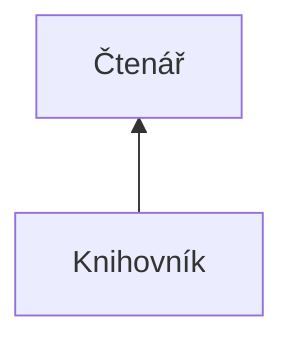
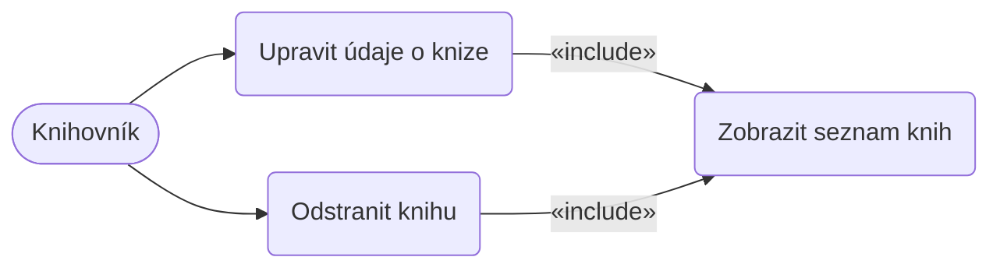
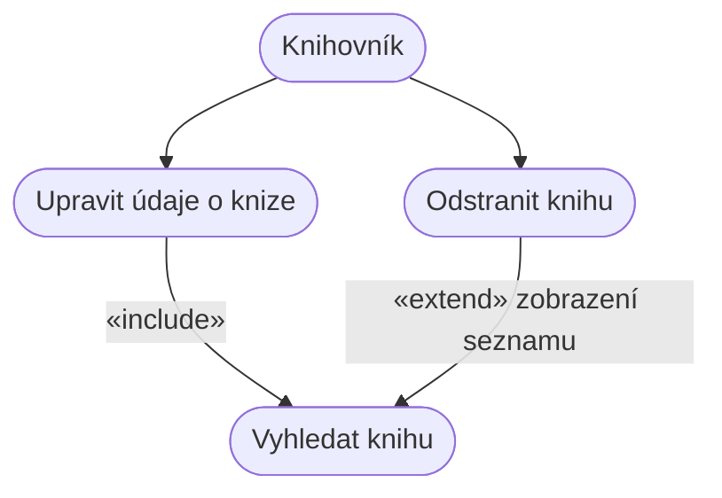

### Proč?
- zpřesnění zadání, podklady pro dokumentaci
- podklady pro akceptační testy
- vyjasnění si požadavků se zákazníkem
- zadání pro programátory
- Případy užití už mohou být formou zadání pro programátory (už vidím aktéry, jaké přesně dělají činnosti apod.)
- Tvoří základ pro tvorbu uživatelské příručky a také slouží jako podklad k tvorbě akceptačních testů

Skládá se z:
1) Seznam účastníků/aktérů
2) Diagram případů užití
3) Seznam případů užití (popis a slovní rozšíření diagramu případů užití)
	- zde lze nadefinovat hlavní a alternativní scénáře + různé výjimky
	- také musím specifikovat podmínky provedení

- generalizace/dědičnost mezi účastníky (účastník může v systému spouštět i všechny případy svého rodiče)
- ==čas je také jeden z aktérů== - v aplikaci mohu mít automaticky spouštěné úlohy na základně nějaké časové události
### \<\<include\>\>
- když mám nějakou část použitou v několika případech užití, tak ji mohu vyjmout, udělat z ní samostatný případ užití a pak ji "naincludovat" do původních případů užití (využití DRY principu)
- povinné zahrnutí případu užití
##### Zobrazit seznam knih
Scénář ukazuje postup při zobrazení seznamu knih:
1. Systém zobrazí seznam knih
2. Uživatel jednu knihu vybere
3. Systém ...
4. Uživatel ...

Případ užití "Zobrazit seznam knih" je zahrnut (include) jak z případu "Upravit údaje o knize", tak z případu "Odstranit knihu". Aktérem je Knihovník.

### \<\<extends\>\>
- používá se, pokud je vyčleněná část scénáře nepovinná

##### Scénář - Odstranit knihu
1. UC začíná, když ....
2. Volitelný krok: zobrazení seznamu knih (toto je rozšiřující část, proto «extend»)
3. Systém odstraní zvolenou knihu

Krok zobrazení seznamu je nepovinný - proto je modelován pomocí «extend», nikoli «include».
### Doporučení při tvorbě
- popisuj, co má systém dělat, ne JAK to má dělat
- nerozepisuj se u "nezajímavých" UC
- diagram je pouze doplňující, hlavní úsilí jde do popisu a do scénářů
- jako doplnění scénáře užití může sloužit také návrh grafiky (wireframes, Figma, náčrty, nákresy...)
- v popisu scénáře se popisuje hlavně interakce uživatele se systémem (tedy jeden bod je akce uživatele a druhý bod je reakce systému atd.)
- Systém a Čas jsou aktéři pouze v případě pokud vykonávají něco **nezávisle** na uživatelské akci
	- kdybych tam zaznačoval jenom reakce systému, tak budu mít aktéra Systém, který bude ukazovat na všechny Use Cases, což nemá moc smysl, ani vypovídající hodnotu

- pokud je analytický tým oddělený od vývojového, tak je nutné minimalizovat nutnou komunikaci (právě fakt dobrým a podrobným diagramem užití)
- pokud je výsledkem projektu nějaký framework či knihovna, tak je třeba zvážit, jestli je potřeba takový diagram vůbec vytvářet
# Chyby v modelu

Diagram případů užití nezobrazuje tok událostí. K tomuto účelu slouží jiné nástroje:
- textové scénáře
- diagram aktivit
- stavový diagram

Diagram případů užití také nezobrazuje datová úložiště ani paměti systému.

Plus každý případ užití musí mít svého aktéra