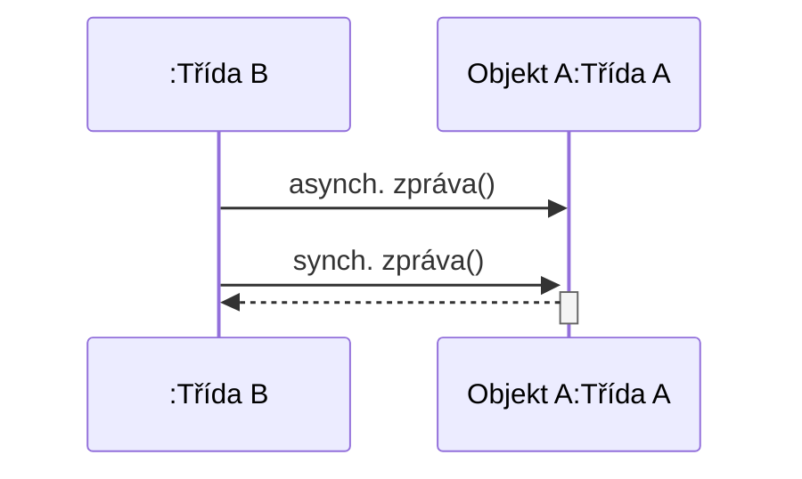
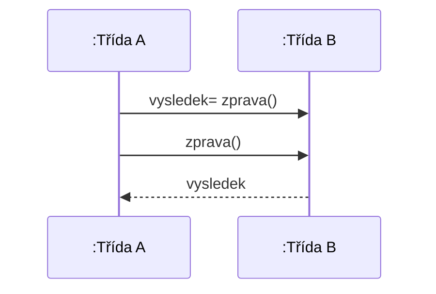
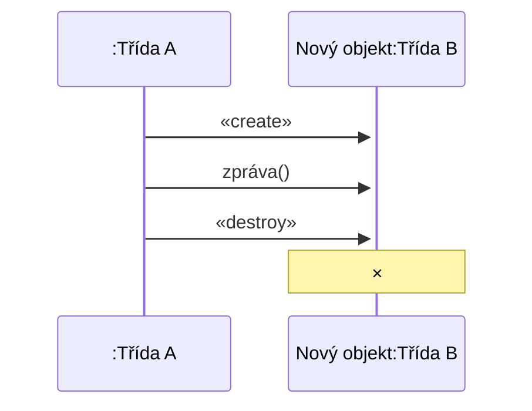
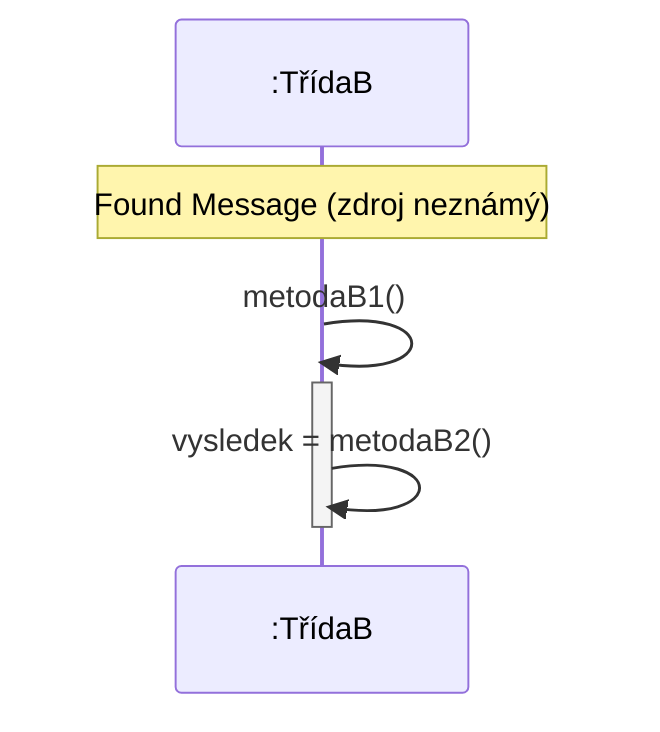
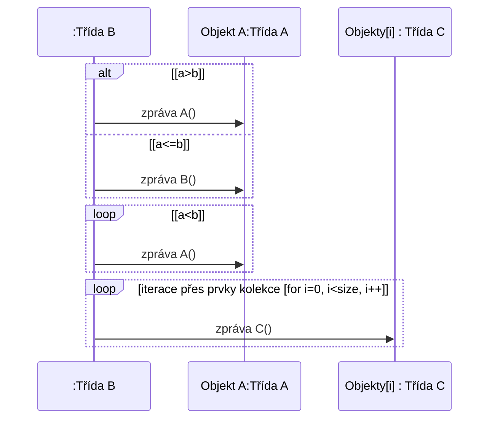
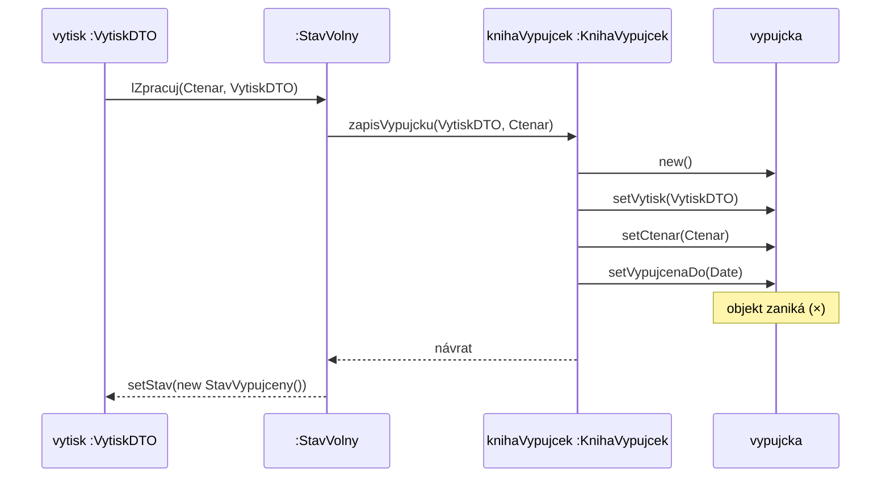

Diagram ukazuje komunikaci mezi dvěma účastníky - instancí třídy B (anonymní) a objektem A třídy A.



Jsou zde znázorněny dva typy zasílání zpráv:
- asynchronní zpráva - odesílatel nečeká na odpověď a pokračuje dál
- synchronní zpráva - odesílatel čeká na návrat řízení zpět (znázorněno přerušovanou šipkou zpět)
- :Třída B je nepojmenovaný objekt, Objekt A:Třída A má jméno Objekt A
	- bez dvojtečky by to byla statická třída
# Návratová hodnota
Existují 2 různé způsoby, jak znázornit návratovou hodnotu v sekvenčním diagramu.



- První způsob zachytí návratovou hodnotu přímo v zápisu volání zprávy ve formátu `vysledek= zprava()`.
- Druhý způsob odešle zprávu `zprava()` a návratová hodnota `vysledek` je vrácena samostatnou přerušovanou šipkou zpět volajícímu.
	- přehlednější je ten druhý způsob
# Vytvoření a zrušení objektu
Sekvenční diagram ukazuje dva klíčové jevy v životním cyklu objektu:
- Vytvoření objektu - znázorněno stereotypem `«create»`, kdy instance Třídy A dynamicky vytvoří nový objekt Třídy B během běhu programu
- Zrušení objektu - znázorněno stereotypem `«destroy»`, po němž životní linie objektu končí symbolem ×


# Sekvenční diagram - speciální typy zpráv

Slide popisuje dva speciální koncepty sekvenčního diagramu:
- Nalezená zpráva (Found Message/Endpoint) - zpráva, jejíž odesílatel není v diagramu znám, znázorňuje se plným kruhem na začátku šipky
- Zaslání zprávy sám sobě (Self Message) - objekt volá vlastní metodu, šipka se vrací zpět na stejný životní pruh

Příklad ukazuje třídu TřídaB, kde `metodaB1()` interně volá `this.metodaB2()` a uloží výsledek - jde tedy o Self Message.



Odpovídající kód třídy:
```java
class TřídaB {
  public void metodaB1() {
    vysledek = this.metodaB2();
  }
  public int metodaB2() {...}
}
```
- "něco" zavolalo metoduB1 - ukazuje se reakce :Třídy B
- volání metody sám na sobě
# Sekvenční diagram - fragmenty
Fragment umožňuje zachytit podmíněné chování a opakování v sekvenčním diagramu. Rozlišujeme tyto druhy fragmentů:
- větvení (alt) - podmíněné větvení podle hodnoty podmínky
- cyklus (loop) - opakování zprávy dokud platí podmínka
- další typy jako opt (volitelné) a par (paralelní)

Iterace přes prvky kolekce se zapisuje jako loop fragment s podmínkou ve tvaru for cyklu, např. `for i=0; i<size(objekty); i++`, přičemž zpráva se odesílá na konkrétní prvek kolekce označený indexem.


- pro větvení se používá ALT, pokud je tam i else větev, pokud je tam jenom if, tak mohu použít OPT
# Ukázka: sekvenční diagram VypujceniVytisku
Diagram zachycuje průběh výpůjčky výtisku mezi objekty systému.



Průběh scénáře:
- Objekt `vytisk` volá na stavu metodu `lZpracuj` s parametry čtenáře a výtisku
- Stav zavolá na knize výpůjček metodu `zapisVypujcku`
- Kniha vytvoří nový objekt `vypujcka` a nastaví mu výtisk, čtenáře a datum vypůjčení do
- Po dokončení se vrátí řízení zpět a stav výtisku se změní na `StavVypujceny`
