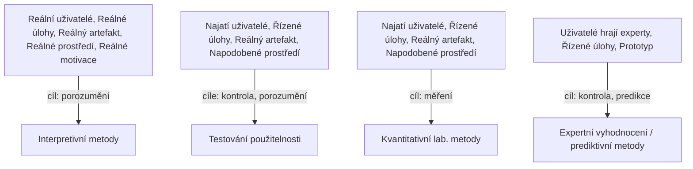

Je to analýza výsledku dané fáze, ptáme se na otázky a snažíme se na ně upřímně odpovědět. Hodně se zaměřujeme na hledání příčin existujících problémů.

Záleží na aktuálním uživateli, v jaké fázi [[UCD (User Centered Design)|UCD]] se nacházíme, kde (v jakém prostředí) se nacházíme, jak je reprezentován artefakt (je to náčrt, prototyp, je dokončený) atd.
Osoba může být reálná osoba, tester, "hrající" HCI expert.

### [[Prediktivní metody v UCD]]
### [[Interpretativní metody v UCD]]
### [[Testování použitelnosti v UCD]]

Hlavní rozdělení:
- Různé metody hodnocení použitelnosti se liší tím, kdo se účastní, jaké úlohy plní a jaké prostředí je použito.

Čtyři hlavní skupiny metod:
- Interpretivní metody - vycházejí z pozorování skutečných uživatelů v reálném kontextu, cílem je hluboké porozumění
- Testování použitelnosti - najatí uživatelé plní řízené úlohy s reálným artefaktem v simulovaném prostředí, cílem je kontrola a porozumění
- Kvantitativní laboratorní metody - podobné podmínky jako testování použitelnosti, ale zaměřené na měření výkonu
- Expertní a prediktivní metody - místo skutečných uživatelů hodnotí experti za použití prototypu, cílem je kontrola a předpovídání problémů

